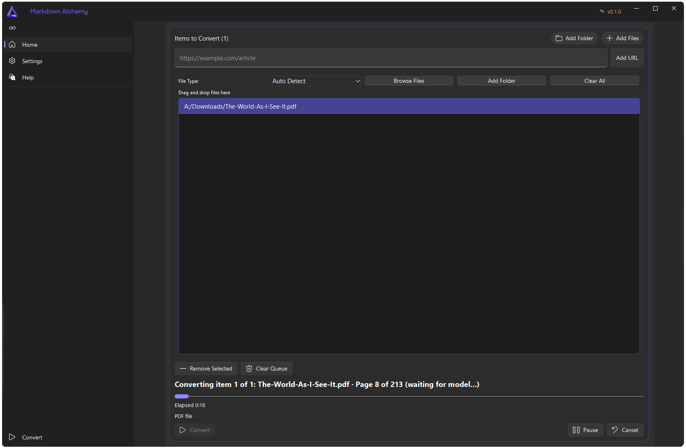

[阅读中文版本](README_zh.md)

# AYRN MarkFlow

A desktop GUI for [MarkItDown](https://github.com/microsoft/markitdown), built with **PySide6** and **QFluentWidgets**. It focuses on fast multi-file conversion to Markdown with a modern Fluent-style interface.



## Fork attribution

**AYRN MarkFlow** is a **fork** of **[markitdown-gui](https://github.com/imadreamerboy/markitdown-gui)** by [Jonas / imadreamerboy](https://github.com/imadreamerboy). The upstream project is an excellent baseline; this repository exists to ship a maintained variant with additional UX, theming, and conversion options.

Following common open-source etiquette:

- **Credit** — Upstream authors and dependencies are listed in [Credits](#credits). This fork does not replace or supersede the original project.
- **License** — You remain bound by the same **GPLv3 (non-commercial)** terms as upstream, including [QFluentWidgets](https://qfluentwidgets.com/) licensing expectations.
- **No endorsement** — Changes here are not endorsed by upstream unless they say so. Bugs that reproduce on the original app may be worth reporting [there](https://github.com/imadreamerboy/markitdown-gui/issues) first.
- **Contributions** — Improvements specific to this fork belong in **this** repository; general fixes that benefit everyone are welcome as PRs upstream when appropriate.

## What’s different in this fork

- **Branding & UI** — **AYRN MarkFlow** identity, refined **Perfect Dark** theme (extra palette + nav/title chrome), centered content column on wide displays, and other layout polish.
- **OCR & models** — Optional **OpenAI-compatible vision** path (e.g. **LM Studio**) for rasterized PDF pages and images; configurable vision prompt/model; optional **“always OCR PDFs”** (skip embedded text) for difficult PDFs. Azure and Tesseract flows from upstream remain.
- **Reliability** — Conversion **cancel** tears down in-flight **HTTP** where applicable; clearer **PDF / model** progress feedback.
- **Queue** — **Add Folder** (flat: **top-level files only**, not subfolders) alongside **Add Files**; file-type filter respected when adding from a folder in the queue view.
- **Internationalization** — English and Chinese (zh_CN) strings extended for new UI.

Upstream features below still apply unless noted.

## Features

- Queue-based file workflow with drag and drop.
- Paste website URLs and convert article content to Markdown with the hosted Defuddle API.
- Batch conversion with start, pause/resume, cancel, and progress feedback.
- Results view with per-file selection and Markdown preview.
- Preview modes: rendered Markdown view and raw Markdown view.
- Save modes: export as one combined file or separate files.
- Quick actions: copy Markdown, save output, back to queue, start over.
- Optional OCR for scanned PDFs and image files — Azure Document Intelligence, local Tesseract, and (in this fork) OpenAI-compatible vision where configured.
- Settings for output folder, batch size, header style, table style, OCR, and theme mode (**light / dark / system / Perfect Dark**).
- Built-in shortcuts dialog, update check action, and about dialog.

## Installation

**Prebuilt binaries:** If maintainers publish builds, install from the **Releases** tab of **this** GitHub repository. You can always run from source.

The original **markitdown-gui** project also publishes [Releases](https://github.com/imadreamerboy/markitdown-gui/releases) for the unmodified app.

### Prerequisites

- Python `3.10+`
- `uv` (recommended)

Install dependencies:

```sh
uv sync
```

Alternative:

```sh
pip install -e .[dev]
```

### OCR Notes

- OCR is optional and disabled by default.
- Local OCR requires a system `tesseract` binary. Install it from the [official Tesseract project](https://github.com/tesseract-ocr/tesseract). If it is not on your `PATH`, set the executable path in Settings.
- Azure OCR requires an Azure Document Intelligence endpoint in Settings.
- Azure Document Intelligence pricing includes [500 free pages per month](https://azure.microsoft.com/en-us/products/ai-foundry/tools/document-intelligence#Pricing) at the time of writing.
- For API-key auth, set `AZURE_OCR_API_KEY`.
- If `AZURE_OCR_API_KEY` is not set, Azure OCR falls back to Azure identity credentials supported by `DefaultAzureCredential`.
- **OpenAI-compatible vision** (e.g. LM Studio): configure base URL, model, and prompt in Settings as documented in-app. You are responsible for any service you point the app at.

### Website URL Notes

- Website conversion uses the hosted [Defuddle](https://defuddle.md/) API.
- The app sends the pasted `http://` or `https://` URL to `https://defuddle.md/<url>` and stores the returned Markdown in the normal results view.
- Defuddle responses typically include YAML frontmatter metadata at the top when available.
- According to the [Defuddle Terms](https://defuddle.md/terms), unauthenticated requests are limited to `1,000` requests per month per IP address as of March 14, 2026.
- Because requests are sent directly from the desktop app, that free-tier limit applies to the user's own network IP.
- Website conversion requires an internet connection and depends on the external Defuddle service being available.

## Run the App

```sh
uv run python -m markitdowngui.main
```

## Keyboard Shortcuts

- `Ctrl+O`: Open files
- `Ctrl+S`: Save output
- `Ctrl+C`: Copy output
- `Ctrl+P`: Pause/resume
- `Ctrl+B`: Start conversion
- `Ctrl+L`: Clear queue
- `Ctrl+K`: Show shortcuts
- `Esc`: Cancel conversion

## Build a Standalone Executable

```sh
uv pip install -e .[dev]
pyinstaller MarkItDown.spec --clean --noconfirm
```

The default spec builds an `onedir` app (folder name depends on your `.spec`, often under `dist/`). Adjust `MarkItDown.spec` if you want the output folder or executable name to match **AYRN MarkFlow**.

## License

Licensed under **GPLv3 for non-commercial use**.

Commercial use requires a separate commercial license.
This follows the non-commercial licensing requirements of `PySide6-Fluent-Widgets` (`qfluentwidgets`).

## Contributing

1. **Fork** this repository (or upstream, if your change belongs there) and create a branch.
2. Install dev dependencies:

```sh
uv pip install -e .[dev]
```

3. Make your changes.
4. Run tests:

```sh
uv run pytest -q
```

5. Open a pull request with a clear summary and, when relevant, a note on whether the same fix should go **upstream** to [markitdown-gui](https://github.com/imadreamerboy/markitdown-gui).

## Credits

- **[markitdown-gui](https://github.com/imadreamerboy/markitdown-gui)** — Original PySide6 / QFluentWidgets GUI wrapper for MarkItDown (this fork’s starting point).
- **MarkItDown** ([MIT License](https://opensource.org/licenses/MIT))
- **PySide6** ([LGPLv3 License](https://www.gnu.org/licenses/lgpl-3.0.html))
- **PySide6-Fluent-Widgets / QFluentWidgets** ([Project site](https://qfluentwidgets.com/))
- The navigation toggle uses a loop glyph derived from the **Lucide** [infinity](https://lucide.dev/icons/infinity) icon ([ISC License](https://lucide.dev/license)).
